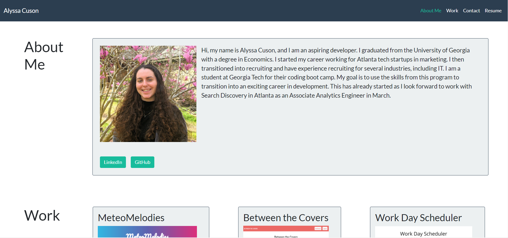

# My Portfolio (Updated)

## Description

This is a simple portfoio that includes an about me, some of my projects, and my contact information.

## Technology

-   HTML
-   Bootstrap

I used a Bootswatch theme called Flatly. Here is the link to view the theme: https://bootswatch.com/flatly/

## Links

To view the portfolio, click here: [https://acuson.github.io/updated-portfolio/](https://acuson.github.io/updated-portfolio/)
To view the repository, click here: [https://github.com/acuson/updated-portfolio](https://github.com/acuson/updated-portfolio)

## Usage

## License

This application is using MIT.